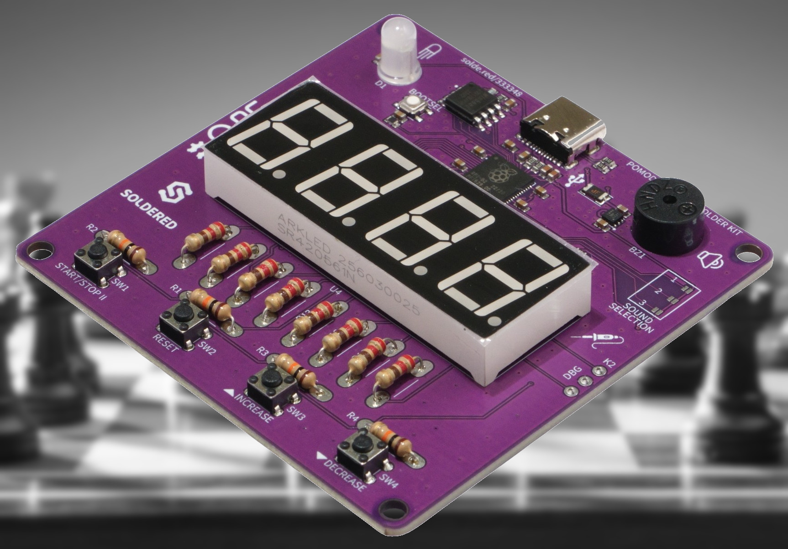

# Chess timer firmware
This repository contains the firmware to configure your [Soldered Pomodoro Timer Solder Kit](https://www.solde.red/333348) as a chess timer. 

**Click the image to see a short introduction video**

The firmware was originally forked from the [Soldered Pomodoro Solder Kit firmware](https://github.com/SolderedElectronics/pomodoro-timer-firmware) repository. For more information on the hardware and software setup please refer to this original repository. 

The following main changes were made: 
* Changed code to be a chess timer rather than Pomodoro timer
* Added more 7-segment display characters
* Added 7-segment display string streaming to enable animations.
* Added Star Wars inspired sounds, created using [onlinesequencer](https://onlinesequencer.net/).
* Minor fixes to code, such as errors relating to playing sounds (made code wait for sounds to complete playing).
